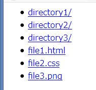

# node-static-alias

[](https://www.npmjs.com/package/node-static-alias) [](https://github.com/anseki/node-static-alias/issues) [](package.json) [](LICENSE-MIT)

Serve static file which is not requested file. (e.g. `file.min.js` is requested, serve `file.js`)  
node-static-alias wraps (inherits) the useful module [node-static](https://github.com/cloudhead/node-static/), and this adds the [`alias`](#alias) option to that.  
This works like the [Alias](http://httpd.apache.org/docs/2.4/mod/mod_alias.html) mapping or the [mod_rewrite
](http://httpd.apache.org/docs/2.4/mod/mod_rewrite.html) of Apache. It looks like [DirectoryIndex](http://httpd.apache.org/docs/2.4/mod/mod_dir.html#directoryindex) too. And this can check the file exists or not.

+ Serve `file.js` instead of `file.min.js` which is not made yet, in the test phase.
+ Serve the outside files of the document-root which are shared by multiple web sites in one machine.
+ Serve the default page which is not `index.html` when *`/` is requested.

## Synopsis

```js
var staticAlias = require('node-static-alias');

// Document-Root: './public' directory
var fileServer = new staticAlias.Server('./public', {
  alias: {
    match: '/path/to/file.min.js',
    serve: '/path/to/file.js'
  }
});

require('http').createServer(function(request, response) {
  request.addListener('end', function() {
    fileServer.serve(request, response);
  }).resume();
}).listen(8080);
```

## Usage

The [`alias`](#alias) option is added to the node-static via using `require('node-static-alias')` instead of `require('node-static')`. See [node-static](https://github.com/cloudhead/node-static/) to use it.

### `alias`

The `alias` included in the constructor options is an Alias-Rule Object, or an array which includes multiple Alias-Rule Objects.

```js
  alias: {
    match: /file\.min\.(?:js|css)$/,
    serve: '/path/to/file.<% suffix %>'
  }
```

Or

```js
  alias: [
    {
      match: '/path/to/file.min.js',
      serve: '/path/to/file.js'
    },
    {
      match: 'suffix=png',
      serve: '../outer/<% fileName %>',
      allowOutside: true
    }
  ]
```

The Alias-Rule Object can have following properties.

### `match`

**Type:** string, RegExp, function or Array

Specify one of below or an Array which includes multiple things of those.  
If one or more things match, the [`serve`](#serve) is parsed. If anything doesn't match, it goes to next an Alias-Rule. If all Alias-Rules don't match, it tries to serve the requested file.

+ **string:**  
If the requested path is equal to this string, it's matched.  
Or, this can be `parameter=value` format (e.g. `suffix=png`). See [Parameters](#parameters). If the `value` is equal to the specified parameter, it's matched.

```js
  alias: [
    {
      match: '/path/to/file.min.js',
      serve: '/path/to/file.js'
    },
    // Image files are not made yet.
    {
      match: 'suffix=png',
      serve: '/path/to/dummy.png'
    }
  ]
```

+ **RegExp:**  
The RegExp which tests the requested path.

```js
  // These image files are not made yet.
  alias: {
    match: /\/(?:foo|bar)\.png$/,
    serve: '/path/to/dummy.png'
  }
```

+ **function:**  
The function which returns `true` or `false`.
The Object which has parameters is passed to this function. See [Parameters](#parameters). Also, current `request` instance and `response` instance are passed.  
In the function, `this` refers to own instance.

```js
  // Kick direct access from outside web site.
  alias: {
    match: function(params, request, response) {
      console.log(request.url + ' was requested, in the path ' + this.root);
      return params.suffix === 'jpg' &&
        params.referer.indexOf('http://mysite.com/') !== 0;
    },
    serve: '/path/to/denial.jpg'
  }
```

### `serve`

**Type:** string, function or Array

Specify one of below or an Array which includes multiple things of those.  
By default, the first file which exists is chosen to try to serve. See [force](#force). If anything doesn't exist, it goes to next an Alias-Rule. If all files of Alias-Rules don't exist, it tries to serve the requested file.

+ **string:**  
The absolute path or relative path from the document-root of the file to serve.  
This can include parameters like `<% parameter %>`. See [Parameters](#parameters).

```js
  // directoryIndex isn't index.html
  alias: {
    match: /\/$/,
    serve: '<% absPath %>/default.html'
  }
```

*NOTE:* If the first character of this string is `/` (it might be parameter), this string is absolute path. This `/` doesn't point the document-root. It is the root of the local filesystem. If you want the relative path from the document-root, don't specify leading `/`, or add `.` to left of leading `/`.

+ **function:**  
The function which returns the absolute path or relative path from the document-root of the file to serve.  
The Object which has parameters is passed to this function. See [Parameters](#parameters). Also, current `request` instance and `response` instance are passed.  
In the function, `this` refers to own instance.

```js
  // Minified files are not made yet.
  alias: {
    match: /\.min\.(?:js|css)$/,
    serve: function(params, request, response) {
      response.setHeader('X-serve-from', this.root);
      return params.absDir + '/' +
        params.basename.replace(/\.min$/, '.') + params.suffix;
    }
  }
```

```js
  // Compile unwatched SASS now.
  alias: {
    match: 'suffix=css',
    serve: function(params) {
      require('exec-sync')('sass ' +
        params.absDir + '/' + params.basename + '.scss:' + params.absPath);
      return params.absPath;
    }
  }
```

### `force`

**Type:** boolean

If `true` is specified, the first file in the [`serve`](#serve) is chosen to try to serve without checking it's existing or not. And if it doesn't exist, a 404 error occurs. Default is `false`.  
This is used to prevent another file from being chosen unintentionally.

### `allowOutside`

If `true` is specified, serving the outside files of the document-root is allowed. Default is `false`.

```js
  // Shared files.
  alias: {
    match: /^\/common_lib/,
    serve: '/path/to/lib/<% fileName %>',
    allowOutside: true
  }
```

*NOTE:* If you specify `true` in the public server, you should specify the absolute path to the [`serve`](#serve). Otherwise the user might access to the file that must be hidden from them.

## Parameters

The string `parameter=value` can be specified to the [`match`](#match), and the string `<% parameter %>` can be specified to the [`serve`](#serve).  
And also, the Object which has parameters is passed to function which specified to the [`match`](#match) and the [`serve`](#serve).  
These parameters are below.

+ `reqUrl`  
The URL which is requested by the user. e.g. `/path/to/file.ext?key1=value1&key2=value2`
+ `reqPath`  
The path which is requested by the user. e.g. `/path/to/file.ext`  
This might be a directory. e.g. `/`
+ `reqDir`  
The path to a directory which is part of `reqPath`. e.g. `/path/to`
+ `absPath`  
The absolute path to a requested file. e.g. `/var/www/public/path/to/file.ext`
+ `absDir`  
The absolute path to a directory which is part of `absPath`. e.g. `/var/www/public/path/to`
+ `fileName`  
The file name of a requested file. e.g. `file.ext`  
This might be a directory name e.g. `to`  
If the document-root is requested, this is empty string.
+ `basename`  
The part of the file name except file-suffix. (`.` isn't included) e.g. `file`
+ `suffix`  
The part of the file name which is extracted file-suffix. (`.` isn't included) e.g. `ext`
+ `reqQuery`  
The URL query string which is part of `reqUrl`. e.g. `key1=value1&key2=value2`
+ Parsed query string  
Pairs of a key beginning with a `query_` and a value. e.g. `query_key1`: `value1`, `query_key2`: `value2` from `reqQuery` above  
An array is extracted and each key is given `[INDEX]`. e.g. `query_key[0]`: `value1`, `query_key[1]`: `value2` from `key=value1&key=value2`
+ Request Headers  
The HTTP Request Headers from the client. These are lower-cased. e.g. `referer`, `user-agent`, etc.

## Logging

The `logger` included in constructor options is a Logger instance of the standard Logging Library (e.g. [log4js](https://github.com/nomiddlename/log4js-node)) which has `info` method or `log` method.

```js
var log4js = require('log4js');
var logger = log4js.getLogger('node-static-alias');
logger.setLevel(log4js.levels.INFO);

var fileServer = new staticAlias.Server('./public' {
  alias: { ... },
  logger: logger
});
```

You can specify a simple Object which has `info` method or `log` method (e.g. `console` or `util`).  
Most easy:

```js
var fileServer = new staticAlias.Server('./public' {
  alias: { ... },
  logger: console
  //logger: require('util') // Add timestamp
});
```

Add project name: (But, you probably use your favorite library.)

```js
var fileServer = new staticAlias.Server('./public' {
  alias: { ... },
  logger: {log: function() {
    var util = require('util');
    console.log('[node-static-alias] ' +  util.format.apply(util, arguments));
  }}
});
```

Log message example:

```console
(/) Requested: "/var/public"
(/file.min.css) Requested: "/var/public/file.min.css"
(/file.min.css) For Serve: "/var/public/file.css" alias[3] match[1] serve[0]
(/file.min.js) Requested: "/var/public/file.min.js"
(/file.min.js) For Serve: "/var/public/file.js" alias[2] match[0] serve[1]
```

The `(path)` is the path which is requested by the user. The `[number]` means an index of an Array.

## Files list in the Directory

This example generates a list of files and directories in requested directory when the user accessed the directory. This works like the [mod_autoindex](http://httpd.apache.org/docs/2.4/mod/mod_autoindex.html) of Apache.

That looks like:  


The [statsFilelist](https://www.npmjs.com/package/stats-filelist) is required.

```
npm install stats-filelist
```

Load that and some core modules.

```js
var filelist = require('stats-filelist'),
  path = require('path'),
  fs = require('fs');
```

Specify for `alias`:

```js
alias: {
  match: function(params) {
    try {
      return fs.statSync(params.absPath).isDirectory();
    } catch (error) {
      return false; // Ignore "Not found" etc.
    }
  },
  serve: function(params) {
    var indexPath = path.join(params.absPath, '.index.html');
    fs.writeFileSync(indexPath,
      '<html><body><ul>' +
      filelist.getSync(params.absPath, /^(?!.*[/\\]\.index\.html$).+$/, false)
        .map(function(stat) {
          var relPath = stat.name + (stat.isDirectory() ? '/' : '');
          return '<li><a href="' + relPath + '">' + relPath + '</a></li>';
        }).join('') +
      '</ul></body></html>');
    return indexPath;
  }
}
```
